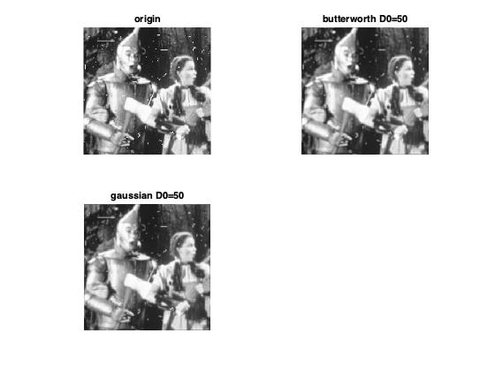
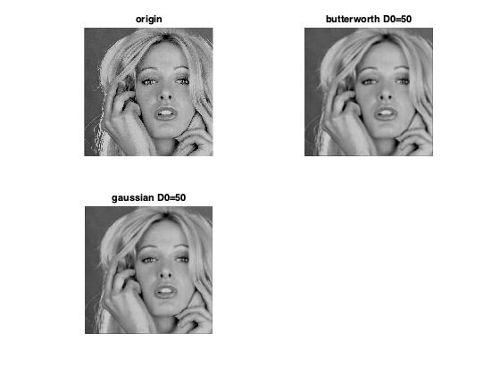
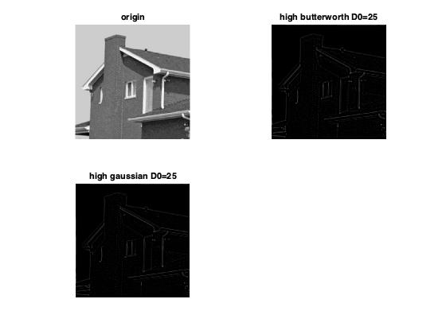
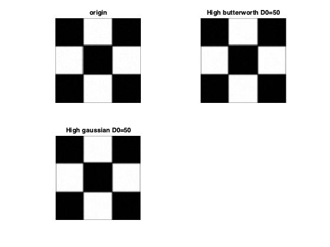
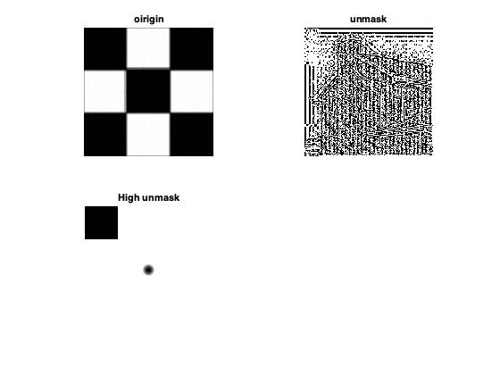
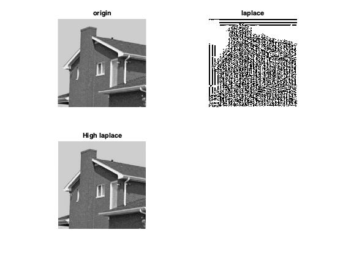

# 数字图像处理第五次作业
### 自动化63
### 杨卓
### 2160504078
---- 
## 作业要求：
1. 频域低通滤波器：设计低通滤波器包括 butterworth and Gaussian (选择合适的半径，计算功率谱比),平滑测试图像test1和2;分析各自优缺点；
2. 频域高通滤波器：设计高通滤波器包括butterworth and Gaussian，在频域增强边缘。选择半径和计算功率谱比，测试图像test3,4：分析各自优缺点；
3. 其他高通滤波器：拉普拉斯和Unmask，对测试图像test3,4滤波；分析各自优缺点；比较并讨论空域低通高通滤波（Project3）与频域低通和高通的关系；
按标准格式提交报告； 

## 1频域低通滤波器：设计低通滤波器包括 butterworth and Gaussian  

### 问题分析

频域滤波是在频率域对图像做处理的一种方法：
&emsp;其包括以下几个步骤：  

①给定一幅大小为m\*n的输入图像f(x,y)，确定填充参数，典型的选取M=2\*m,N=2\*n;

②对f(x,y)添加必要数量的0，形成大小为P\*Q的填充后的图像fp(x,y);

③用(-1)^(x+y)乘以fp(x,y)移到变换中心；

④计算来自步骤三的图像的DFT，得到F(u,v);

⑤生成一个实的、对称的滤波函数H(u,v),其大小为P\*Q，中心在(P/2,Q/2)的位置处，用阵列相乘得到乘积G(u,v)=H(u,v)\*F(u,v)  
⑥得到处理后的图像：
其中滤波器大小与频谱大小相同，相乘即可得到新的频谱。  
功率谱  
建立一组标准截止频率轨迹的一种方法试计算包含规定的总图像功率值Pt的圆。该值是通过求每个点（u，v）处填充后图像的功率谱分量
的和得到的。
### 处理结果
D0=25

D0=50

D0=75

### 结果分析
所选用的Gaussian滤波器和butterworth滤波器半径D0越小，平滑作用越明显，图像越模糊，滤波器功率谱越来越小。  
Gaussian滤波器和一阶butterworth滤波器在相同截止频率D0时效果相似，但后者功率谱比更小。  
butterworth滤波器阶数越高，图像处理后功率谱比越高。
### 源代码
	%5.1
	A = inputdlg('D0');
	D0 = str2num(cell2mat(A));
	i=imread('test2.tif');
	Fourier=double(i);
	Fourier=fft2(Fourier);
	Fourier=fftshift(Fourier);
	[p,q]=size(Fourier);
	n=2;
	for u=1:p
	    for v=1:q
	      D(u,v)=sqrt((u-fix(p/2))^2+(v-fix(q/2))^2);
	      H(u,v)=1/(1+(D(u,v)/D0)^(2*n));
	      G(u,v)=H(u,v)*Fourier(u,v);
	    end
	end
	butterworth=ifftshift(G);
	butterworth=ifft2(butterworth);
	butterworth=uint8(real(butterworth));
	for u=1:p
	    for v=1:q
	      D(u,v)=sqrt((u-fix(p/2))^2+(v-fix(q/2))^2);
	      H(u,v)=exp(-D(u,v)^2/(2*D0^2));
	      G(u,v)=H(u,v)*Fourier(u,v);
	    end
	end
	gaussian=ifftshift(G);
	gaussian=ifft2(gaussian);
	gaussian=uint8(real(gaussian));
	figure(1);
	subplot(221)
	imshow(i);
	title('origin');
	subplot(222)
	imshow(butterworth);
	title(['butterworth D0=',num2str(D0)]);
	subplot(223)
	imshow(gaussian);
	title(['gaussian D0=',num2str(D0)]);
	
	  
## 2、频域高通滤波器：设计高通滤波器包括butterworth and Gaussian，在频域增强边缘。选择半径和计算功率谱比，测试图像test3,4：分析各自优缺点；
### 问题分析  
其包括以下几个步骤：
① 给定一幅大小为m\*n的输入图像f(x,y)，确定填充参数，典型的选取M=2\*m,N=2\*n;
②对f(x,y)添加必要数量的0，形成大小为P\*Q的填充后的图像fp(x,y);
③用(-1)^(x+y)乘以fp(x,y)移到变换中心；
④计算来自步骤三的图像的DFT，得到F(u,v);
⑤生成一个实的、对称的滤波函数H(u,v),其大小为P\*Q，中心在(P/2,Q/2)的位置处，用阵列相乘得
到乘积G(u,v)=H(u,v)\*F(u,v)
⑥得到处理后的图像：
### 处理结果
D0=25

D0=50

D0=75

### 结果分析
高通滤波器可以增强边缘，滤除低频分量。图中低频部分呈现灰色是因为在最后imshow显示图片阶段我选择用[] 参数将图片最小值（负值）与最大值（正值）对齐到[0,255]，因此原本0附近的值现在变到了128附近。  
以test3为例，处理后的黑色和白色的线是检测到的边缘，即高频部分，它们的绝对值最大，而原图中低频部分如大片的黑色或白色，在处理后表现形式一致。  
同一类型的滤波器，所设计的截止频率D0越高，被滤除的低频分量越多，边缘越清晰。  
### 源代码
	%5.2
	A = inputdlg('D0');
	D0 = str2num(cell2mat(A));
	i=imread('test4 copy.bmp');
	Fourier=double(i);
	Fourier=fft2(Fourier);
	Fourier=fftshift(Fourier);
	[p,q]=size(Fourier);
	n=2;
	for u=1:p
	    for v=1:q
	      D(u,v)=sqrt((u-fix(p/2))^2+(v-fix(q/2))^2);
	      H(u,v)=1/(1+(D0/D(u,v))^(2*n));
	      G(u,v)=H(u,v)*Fourier(u,v);
	    end
	end
	butterworth=ifftshift(G);
	butterworth=ifft2(butterworth);
	butterworth=uint8(real(butterworth));
	for u=1:p
	    for v=1:q
	      D(u,v)=sqrt((u-fix(p/2))^2+(v-fix(q/2))^2);
	      H(u,v)=1-exp(-D(u,v)^2/(2*D0^2));
	      G(u,v)=H(u,v)*Fourier(u,v);
	    end
	end
	gaussian=ifftshift(G);
	gaussian=ifft2(gaussian);
	gaussian=uint8(real(gaussian));
	figure(1);
	subplot(221)
	imshow(i);
	title('origin');
	subplot(222)
	imshow(butterworth);
	title(['high butterworth D0=',num2str(D0)]);
	subplot(223)
	imshow(gaussian);
	title(['high gaussian D0=',num2str(D0)]);

## 3.其他高通滤波器：拉普拉斯和Unmask，对测试图像test3,4滤波；分析各自优缺点；
### 处理结果  

### 结果分析
①对比每组图像处理结果中的原始图像和滤波后的图像，可以看到滤波器边缘增强的效果；
②对于拉普拉斯算子和unmask滤波，两者达到的滤波效果基本上是一致的。
### 源代码
	i=imread('test4 copy.bmp');
	f=double(i);
	Fourier=fft2(f);
	Fourier=fftshift(Fourier);
	[p,q]=size(Fourier);
	c=1;
	 
	for u=1:p
	    for v=1:q
	      D(u,v)=sqrt((u-fix(p/2))^2+(v-fix(q/2))^2);
	      H(u,v)=c*4*pi^2*D(u,v)^2;
	      G(u,v)=H(u,v)*Fourier(u,v);
	    end
	end
	g=ifftshift(G);
	g=ifft2(g);
	g=uint8(real(g));
	%???
	maxf2=max(max(real(g)));
	for u=1:p
	    for v=1:q
	        g1(u,v)=f(u,v)+g(u,v)/maxf2;
	    end
	end
	g1=uint8(real(g1));
	 
	figure(1);
	subplot(221)
	imshow(i);
	title('origin');
	subplot(222)
	imshow(g);
	title('laplace')
	subplot(223)
	imshow(g1);
	title('High laplace')
	i=imread('test3_corrupt.pgm');
	f=double(i);
	Fourier=fft2(f);
	Fourier=fftshift(Fourier);
	[p,q]=size(Fourier);
	k1=1;k2=1;D0=100;
	 
	for u=1:p
	    for v=1:q
	      D(u,v)=sqrt((u-fix(p/2))^2+(v-fix(q/2))^2);
	      H(u,v)=1-exp(-D(u,v)^2/(2*D0^2));
	      G(u,v)=(k1+k2*H(u,v))*Fourier(u,v);
	    end
	end
	g=ifftshift(G);
	g=ifft2(g);
	g=uint8(real(g));
	figure(2);
	subplot(221)
	imshow(i);
	title('oirigin');
	subplot(222)
	imshow(g);
	title('unmask')
	subplot(223)
	imshow(abs(225.*H./max(max(H))));
	title('High unmask')
	
  
  
  